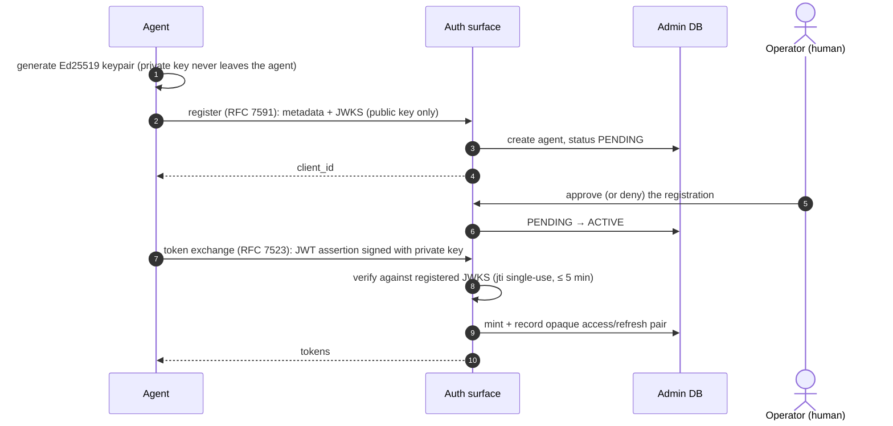

# Identity and authorization

Who can call what, and where that decision is made. This is the conceptual
map; per-route permission requirements live in
[`docs/reference/endpoints.md`](../reference/endpoints.md), and the auth
surface's protocol details (discovery documents, registration endpoints) in
[`docs/reference/`](../reference/README.md).

## Actors

Every authenticated request resolves to one `Identity`
([`shared/auth/identity.py`](../../src/jentic_one/shared/auth/identity.py)) with an explicit `actor_type`
([`shared/models/actors.py`](../../src/jentic_one/shared/models/actors.py)) — verification fails closed on a token that
doesn't name one:

| Actor | Who it is | Typical credential |
| ----- | --------- | ------------------ |
| `user` | A human operator, signed in through the SPA or `jenticctl`. | Session token (JWT), or a password login exchanged for one. |
| `agent` | An AI agent owned by a user. Registered first, approved by a human before it can act. | Ed25519-signed assertion → opaque access token, or a `jak_` API key. |

Agents are the only machine identity. Headless integrations (CI jobs, cron
runners, scripts) register as an agent and authenticate with its `jak_` API
key.

Two former actor kinds are retired (see the
[release runbook](../development/releasing.md)):

- **`service_account`** — removed in theme 8. The migration converted each
  service account into a successor agent, carrying over its grants and
  bindings. In 0.41 (theme-8 Phase 4) the service-account tables are dropped
  and **`sak_` keys stop working**: every surface answers a `sak_` key with a
  401 whose detail says service-account keys were retired and to mint a
  `jak_` key for the successor agent (an INFO `retired_service_account_key_refused`
  log line names that agent). No new `sak_` keys are issued; the
  `/service-accounts` API, `POST /oauth/mint`, and the `client_credentials`
  grant are gone. `service_account` is no longer an `ActorType` value.
  Leftover `service_account` token rows fail closed on every path, and
  historical `sva_` ids in audit and event rows are labelled, never
  resolved.
- **`toolkit`** — on 0.40.x a startup migration turned each `jntc_live_`
  toolkit key into a successor agent (it minted a service account before
  theme 8, and those service accounts migrate like any other). The toolkit
  tables are dropped in 0.41 (theme-5 Phase 6b); a retired plaintext keeps
  authenticating as its successor agent through the migrated digest, until
  no earlier than 2026-12-01.

An agent's `Identity` carries its owner (`parent_actor_id`) and the owner's
effective permissions (`parent_permissions`): an agent can never out-rank
the human it belongs to.

### How a human signs in

Three mechanisms mint a `user` session, and they are mutually arranged, not
stacked:

1. **First-party password login** — the SPA posts to `POST /auth/login`
   (admin surface) and gets a session JWT. Always on; this is the default
   OSS sign-in.
2. **Local-account login on the OAuth flow** (`auth.local_login.enabled`,
   default **off**) — a password form on `/authorize` for standards-track
   native-app sign-in (RFC 8252). Unlike mechanism 1 it does not hand back
   a JWT: the form mints an OAuth authorization code, exchanged for tokens
   like any other client.
3. **External IdP** (`auth.idp.enabled`, generic OIDC or Google) — the
   `/authorize` flow delegates to the provider and provisions/refreshes the
   user on callback. When enabled, the IdP **always wins**: the local-login
   form is never offered (no mixed mode).

## How an agent gets a token

Agent identity is asymmetric — the platform never holds the agent's private
key:

1. **Register** ([`auth/`](../../src/jentic_one/auth/) surface, RFC 7591/7592 dynamic client
   registration): the agent submits metadata plus a JWKS containing at least
   one **Ed25519** public key (`registration_service.py` rejects anything
   else, including any private-key material).
2. **Wait for approval**: registration lands as a `PENDING` agent; a human
   approves or denies it (`agent_service.py`). Until approval, token
   exchange answers "pending", distinct from a rejected assertion.
3. **Exchange** (RFC 7523 JWT-bearer grant, `assertion_service.py`): the
   agent signs a short-lived assertion (≤ 5 minutes, single-use `jti`) with
   its private key; the auth surface verifies it against the registered
   JWKS and mints an opaque access/refresh token pair, recorded in the
   admin DB. Two scope caveats: the `jti` replay cache is **process-local**
   (an in-memory dict, not the shared-state backend), so with multiple auth
   replicas an assertion is single-use per replica, not per instance; and
   the `exp`/`iat` checks run with **zero clock leeway**, so a client clock
   more than a few seconds fast produces `iat` rejections — keep both ends
   on NTP.

Operators and the SPA use session JWTs minted at login; agent API
keys (`jak_`, plus legacy `jntc_live_` plaintexts that resolve as their
successor agents once migrated; retired `sak_` keys are refused) are the
long-lived alternative,
dispatched by prefix and matched by digest against
the admin DB ([`shared/auth/api_key_resolver.py`](../../src/jentic_one/shared/auth/api_key_resolver.py)). JWT verification for
asymmetric tokens allows only asymmetric algorithms — `alg: none` and all
HMAC algorithms are rejected ([`shared/auth/jwt_verification.py`](../../src/jentic_one/shared/auth/jwt_verification.py)).

## Permissions

Two vocabularies meet here, and keeping them apart is what makes the code
readable:

- A **permission** is what an actor may do inside this platform — the string
  stored in `actor_permission_grants`, carried on `Identity.permissions`, and
  checked by route guards, the UI, and the CLI.
- A **scope** is the same string travelling over this deployment's own
  OAuth2/OIDC plane: a client's `allowed_scopes`, `scopes_supported` in
  discovery, the consent-time set on a grant, `access_tokens.scopes` on a
  minted token. (Third-party credential scopes are a third, unrelated thing —
  they belong to the upstream API, not to us.)

The two formats are identical today, and
[`shared/auth/verify.scopes_to_permissions`](../../src/jentic_one/shared/auth/verify.py)
is the named boundary where a token's scopes become an identity's permissions.
Symbols are **named for what they return, not for what they read**:
`resolve_effective_scopes` ([`auth/services/token_service.py`](../../src/jentic_one/auth/services/token_service.py))
reads internal permission grants but returns a token's OAuth2 scope set, so it
is named for scopes.

Permissions shared across surfaces are canonical constants in
[`shared/auth/permission_catalog.py`](../../src/jentic_one/shared/auth/permission_catalog.py),
re-exported by [`admin/core/permissions.py`](../../src/jentic_one/admin/core/permissions.py)
so admin stays the documented home for the concepts. The shape of the system:

- **`capabilities:execute`** is the one permission the broker's data plane
  requires. Every accepted credential kind must carry it.
- **`DEFAULT_AGENT_PERMISSIONS`** is the safe agent baseline: execute, reads
  (`apis:read`, `executions:read`, `jobs:read`, `events:read`,
  `capabilities:read`), `catalog:import`, `credentials:connect` (start a
  vendor connect flow — narrower than `credentials:write`), and the
  `owner:*:read` delegation permissions for resources, agents, and credentials.
  `MCP_TOOL_SCOPES` is the same set seen from the OAuth2 plane — the ceiling on
  what a client registered at the anonymous DCR door may ask for.
- **There is no self-service permission elevation.** Permissions are granted
  by an operator on the agent detail surface, so the privileged permissions —
  `org:admin`, `agents:write`, `overlays:confirm` — can never be reached
  through an agent-facing path: neither an agent nor a merely agent-owning
  operator can escalate.
- **`owner:<resource>:read`** permissions power delegation: an operator
  holding them sees their agents' rows (e.g. credentials) without being org
  admin. The `scoping/filters.py` modules translate these into row-level
  filters (see
  [surfaces and layering](surfaces-and-layering.md#the-scoping-packages)).

## Enforcement points

Authorization is checked at three distinct layers, and they answer
different questions:

1. **Route admission** (`web/`): every non-health router declares an auth
   dependency (enforced by [`tests/arch/test_web_layer.py`](../../tests/arch/test_web_layer.py)); the dependency
   verifies the credential, resolves the `Identity`, and checks the route's
   permission. On the broker, `CachedTokenValidator`
   ([`broker/core/token_validation.py`](../../src/jentic_one/broker/core/token_validation.py)) fronts the resolvers with a short-TTL
   cache keyed on the token's SHA-256 (both hits and misses cached, LRU
   bounded).
2. **Row visibility** (`scoping/`): services pass the identity's access
   filters into repos, so a list endpoint only ever queries the rows the
   caller may see.
3. **Execution permission** (broker): a brokered call must additionally
   match a permission rule on the agent's credential binding. This is
   **default-deny** — an agent with `capabilities:execute` and a valid
   credential still cannot call an API unless a human-approved
   agent-credential binding explicitly allows that vendor/API/operation
   (see [broker execution](broker-execution.md)).

The chain for an agent's first real call is therefore: registration
approval (human) → credential binding, via a consented vendor connect flow
or an operator-made bind (human) → permission check (route) → permission rule
(call). Each step is auditable, and none is implied by the previous one.

## Related

- [Connecting agents](../guides/connecting-agents.md) — the same flow from
  the agent's point of view.
- [How credential resolution works](../guides/credentials-and-toolkits.md) —
  what happens after authorization succeeds.
- [Security](../security/README.md) — threat model and hardening posture.
